# Winder - Hackathon d'Angular

## Equipe : 

Moad Benayadi

Lucas Bouchet 

[Manon Deleest](https://github.com/manon-deleest) 

Océane Guilloizeau 

[Benjamin Pelaudeix](https://github.com/Benjamin-Pelaudeix)

[Valentin Rougier](https://github.com/valentinrougier39)

[Florian Toribio](https://github.com/sepios87)

**Ressources :** 

[Figma](https://www.figma.com/file/ZJbG9Fepqxh2l0WkgPibsb/Winder?node-id=5%3A24) 

[Présentation](https://docs.google.com/presentation/d/1gnTYzpb63A666igJ6cmY6eTgispkytB47Bt_b3QLP2o/edit?usp=drivesdk)

## Le Sujet 

Fort de son implémentation côtière, La Rochelle offre un cadre idéal aux disciplines nautiques, notamment la voile. Avant d'atteindre le niveau professionnel, bons nombres d'associations et de projets bénévoles se développement dans le monde de la voile mais ne sont pas forcément équipés numériquement pour gérer et administrer l'ensemble des acteurs du nautisme Rochelais.

Par équipe mixtes DFS/WDI, vous devez développer un produit/une application/un site/un outils, dans le domaine de la voile et son écosystème.

L'événement débutera du jeudi 31 mars à 9h, jusqu'au vendredi 01 avril 12h sans interuption pour la partie projet. Le vendredi à 14h débutera la présentation des dits-projets.

Vous devez rendre votre projet réalisé avec Angular pour le vendredi 12h, heure du dernier commit sur gitlab de l'université faisant foi. Vous présenterez votre projet et son concept lors d'une présentation commerciale à partir de vendredi 14h.

Pour vous épauler, chaque équipe aura un capitaine tiré au sort le matin-même de l'épreuve. Ils seront là pour vous aiguiller dans vos choix techniques et fonctionnels. Ces capitaines sont des développeurs expérimentés qui viennent vous donner de leurs temps, alors n'hésitez pas à les solliciter et échanger avec eux sur le métier en général ! 😉

## Notre projet 

Notre objectif ? Aider Pascal à réserver le bon voilier pour ses vacances sans se ruiner. Winder va lui permettre de trouver le voilier qui correspond à ses envies, mais aussi à ses contraintes. 

### Logo et Nom 

Pour ce projet, nous avons créé un logo et une image de marque. Le logo reprend le nom en formant des voiles avec le W. Le format miniature de ce logo reprends seulement le W le logo initiale. 

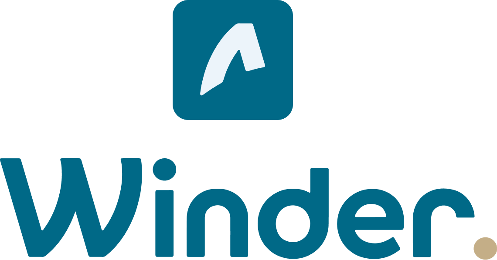

### Charte graphique

Nous avons choisis ces couleurs :

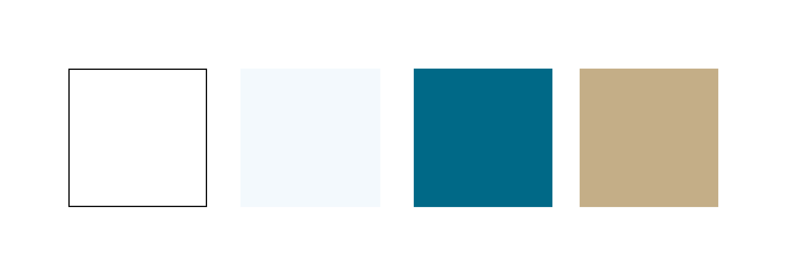

### Développement

#### Technologie 

Pour le hackaton :

- Frontend : Angular 

- Backend : Directus (CMS Headless) 

#### Fonctionnalités 

##### Composants

La première étape développé pour ce projet sont les composants: 

- Le menu : 

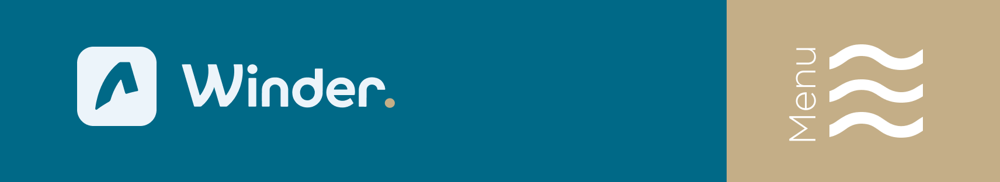

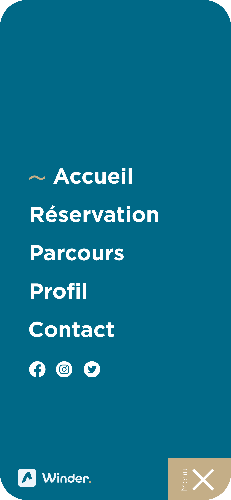

##### Connexion 

Nous avons ensuite développé la connexion et l'inscription à l'application : 

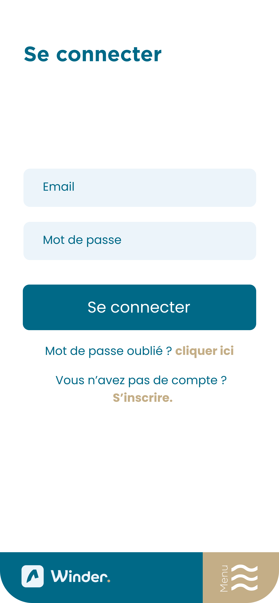

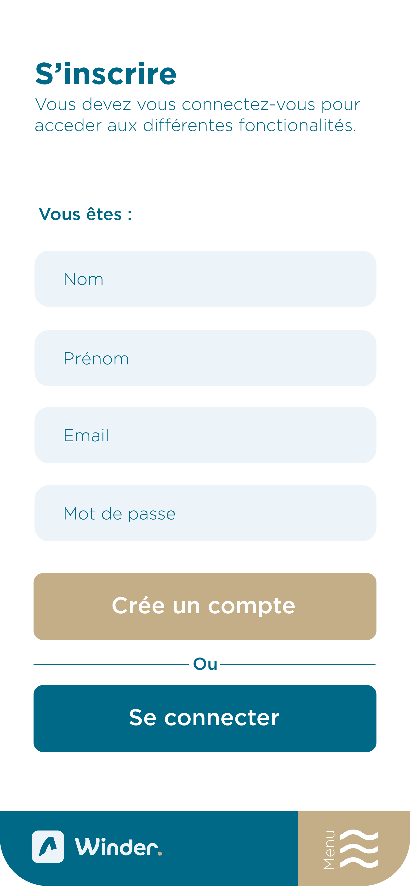

 

##### Accueil 

Nous avons ensuite développé la page d'accueil : 

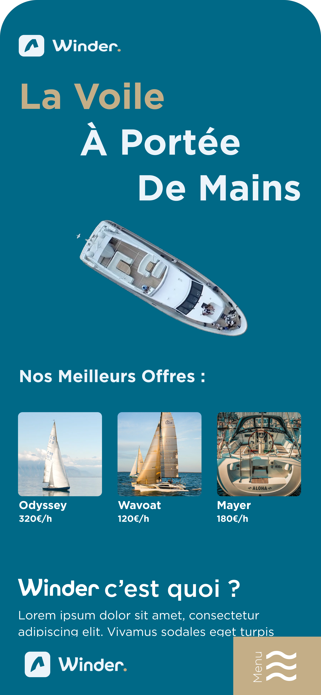

##### Liste des produits 

Nous avons ensuite développé la page qui affiche l'ensemble des produits disponibles :

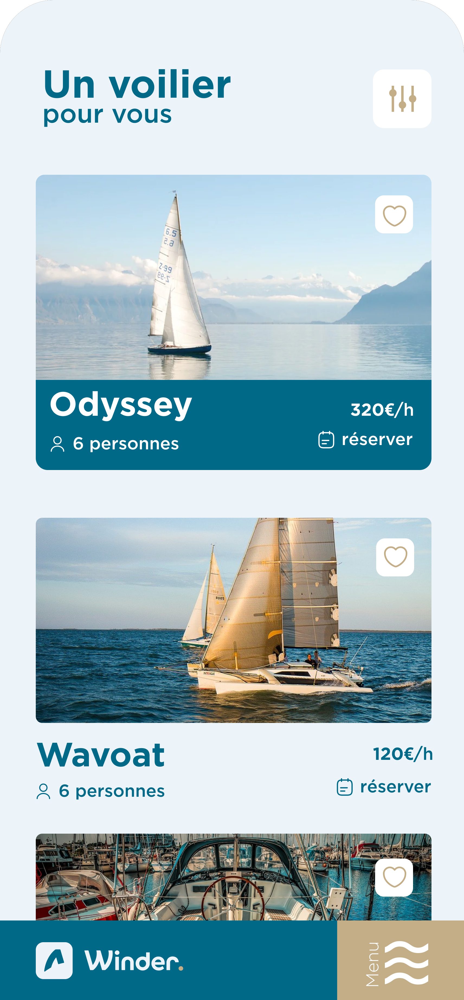

##### Recherche 

Cet liste des produits pourra être trié par l'utilisateur grâce à des critères de filtres : 

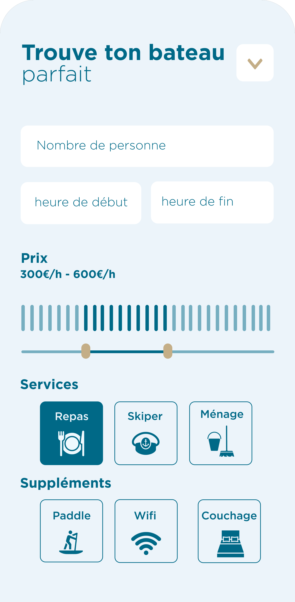

##### Affichage d'un produit 

Nous avons ensuite développé la page qui affiche les informations d'un produit : 

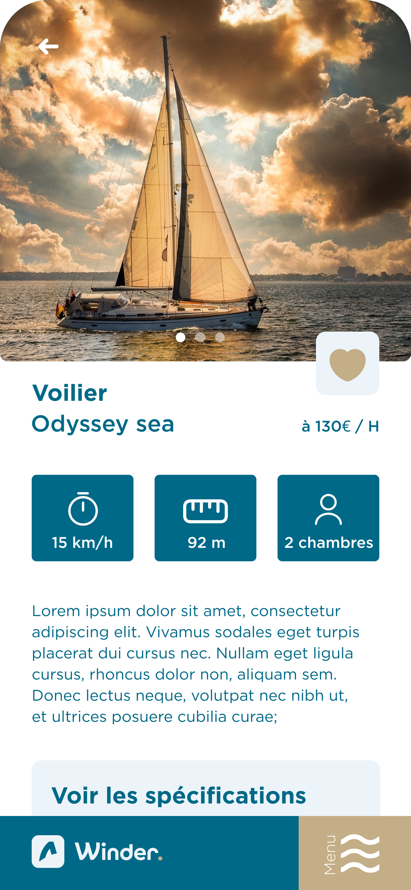

##### Réservation 

Une fois que l'utilisateur à choisie un produit, il a la possibilité de réserver le bateau :  

##### Recherche de trajet 

Une pages de recherche de trajets va permettre aux utilisateurs de trouver une boucle à faire avec le bateau dans le cas ou l'on ne connais pas les lieux. 

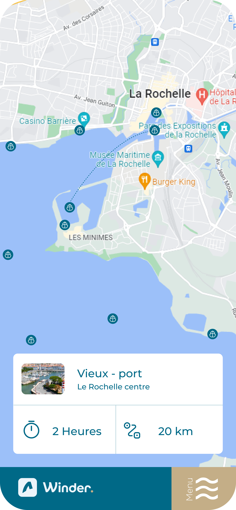

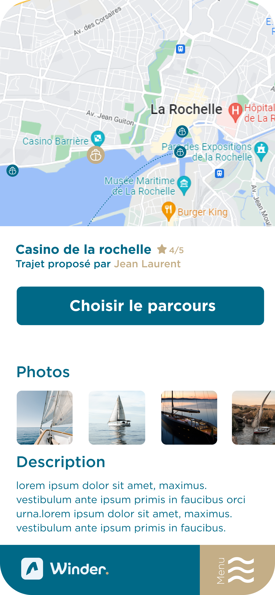

##### Page de contact

Un page a aussi été développé afin de permettre aux utilisateurs de contacter nos services : 

##### Gestion du profile

L'utilisateur pourra aussi gérer sons profils et ses informations : 

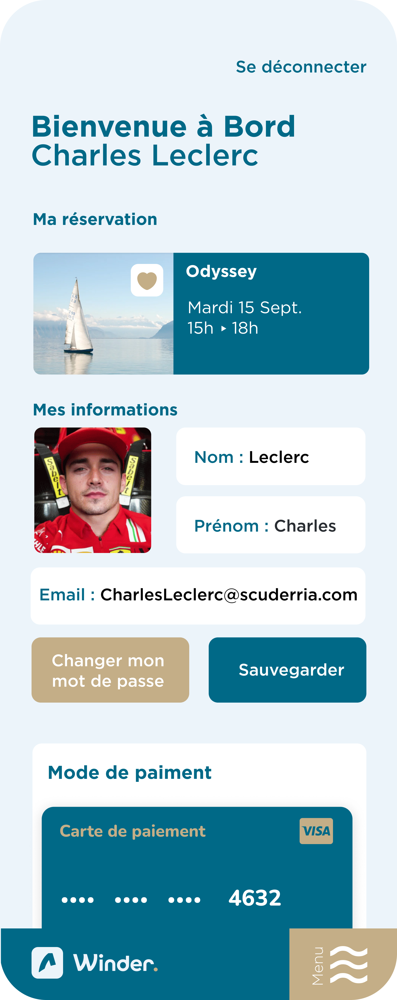

### Communication

Pour promouvoir notre produit, nous avons mis en place une stratégie de communication. Celle-ci comprend la création  :

- d'affiches (abri-bus, affichage municipal, affiche murale...)

- d'une vidéo promotionnelle

- présentation du produit 

#### Affiches

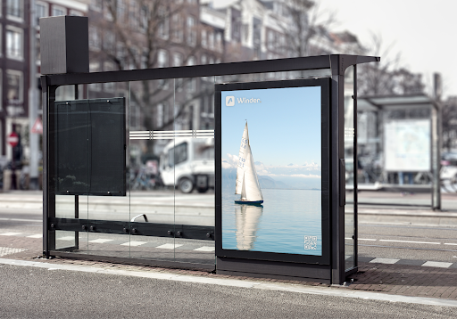

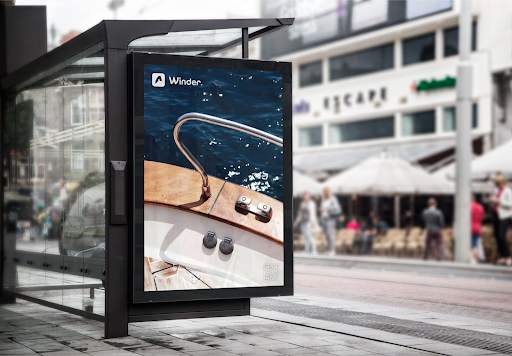

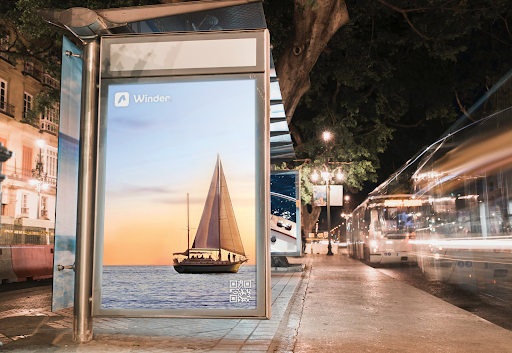

#### Vidéo Promotionelle

[Vidéo promotionelle du produit](https://drive.google.com/file/d/16rhfTNe1xQagU1JRPb3qQ_NcEKzUjNZk/view?resourcekey)

### Présentation 

[Diaporama]()

